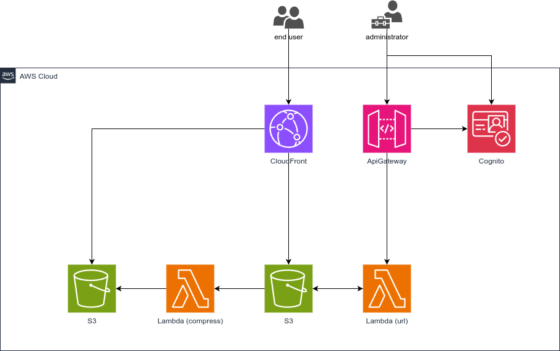

# Blog Photo Hosting

This is a simple blog photo hosting service that allows users to securely upload pictures and get shareable links for their blogs. The infrastructure is deployed on AWS using the Cloud Development Kit (CDK). Additionally, a companion CLI tool, `s3-uploader`, is provided to simplify authentication and photo uploads.

---

## Structure

### **Infrastructure**

The project utilizes AWS CDK to provision the following resources:

- **Amazon S3**: Stores uploaded images securely.
- **Amazon CloudFront**: Serves images via a CDN for faster global delivery.
- **AWS Lambda**: Generates pre-signed URLs for secure uploads.
- **Amazon Cognito**: Handles user authentication and authorization.
- **Amazon API Gateway**: Provides REST API endpoints to interact with the service.

#### **AWS Architecture**



---

## Features

- **Secure Uploads**: Users must authenticate via **Amazon Cognito** to upload photos.
- **CDN Support**: Images are served through **Amazon CloudFront** for faster load times and improved caching.
- **Public Access**: Uploaded photos are accessible via public URLs, either through CloudFront or S3.

---

## Deployment

To deploy this service, follow these steps:

### **Prerequisites**

1. **Install AWS CLI**:
   - [AWS CLI Installation Guide](https://docs.aws.amazon.com/cli/latest/userguide/install-cliv2.html)

2. **Install AWS CDK**:

   ```bash
   npm install -g aws-cdk
   ```

3. **Configure AWS Credentials**:
   - Set up your AWS CLI credentials using:

     ```bash
     aws configure
     ```

4. **Install Dependencies**:
   - Run the following command in the project root directory:

     ```bash
     npm install
     ```

---

### **Configuration**

you will need to create a `parameters.ts` file that holds the configuration for your slack workspace.

create a `parameters.ts` file in the root directory of the project and add the following content:

```typescript
import { SlackConfig } from "./parameters.types";

export const slackParams: SlackConfig = {
  slackChannelConfigurationName: "my-app-alerts",
  slackWorkspaceId: "TXXXXXXXXXX",
  slackChannelId: "CXXXXXXXXXX",
};
```

---

### **Deployment Steps**

1. **Deploy the Stack**:

   ```bash
   cdk deploy
   ```

2. **Outputs**:
   - After a successful deployment, note the following:
     - **BucketName**: S3 bucket for image storage.
     - **ApiUrl**: API Gateway endpoint for generating pre-signed URLs.
     - **UserPoolId**: Cognito User Pool ID.
     - **UserPoolClientId**: Cognito User Pool Client ID.
     - **CloudFrontUrl**: URL for accessing images via CDN.

---

## CLI Tool: `s3-uploader`

The `s3-uploader` CLI tool simplifies the authentication and image upload process. It interacts with the API Gateway endpoint to generate pre-signed URLs and upload images.

---

### **Installation**

1. Clone the repository:

   ```bash
   git clone https://github.com/edge2992/blog-photo-hosting.git
   cd blog-photo-hosting/cli
   ```

2. Build the CLI tool:

   ```bash
   go build -o s3-uploader
   ```

3. Make the CLI tool globally accessible:

   ```bash
   sudo mv s3-uploader /usr/local/bin
   ```

---

### **Usage**

After installation, use the following commands to authenticate and upload photos:

#### **Authenticate with Cognito**

Run the `auth` command to authenticate with Amazon Cognito and save credentials locally for future use:

```bash
s3-uploader auth
```

**Example Output**:

```txt
Configuration file not found. Let's create it interactively.
Enter Cognito Client ID: your-client-id
Enter Cognito Username: your-username
Enter Cognito Password: your-password
Enter API Endpoint: https://example.com
Configuration saved successfully.
```

#### **Upload a Photo**

Use the `upload` command to upload a photo to S3 using a pre-signed URL:

```bash
s3-uploader upload --file ./image.jpg --key blog-images/image.jpg
```

**Example Output**:

```txt
Pre-Signed URL: https://your-s3-bucket.s3.amazonaws.com/blog-images/image.jpg?...
Successfully uploaded file to S3.
```

#### **Other Commands**

- **`completion`**: Generate autocompletion scripts for your shell.

  ```bash
  s3-uploader completion bash
  ```

- **`help`**: View detailed help for any command.

  ```bash
  s3-uploader help upload
  ```

---

## Example Workflow

1. **Authenticate**:

   ```bash
   s3-uploader auth
   ```

2. **Upload a Photo**:

   ```bash
   s3-uploader upload --file ./photo.jpg --key blog-photos/photo.jpg
   ```

3. **Embed the Photo in Your Blog**:
   Use the URL provided by CloudFront or S3 to include the image in your blog:

   ```html
   /blog-photos/photo.jpg" alt="Blog Photo">
   ```

---

## License

This project is licensed under the MIT License. See the [LICENSE](./LICENSE) file for details.
